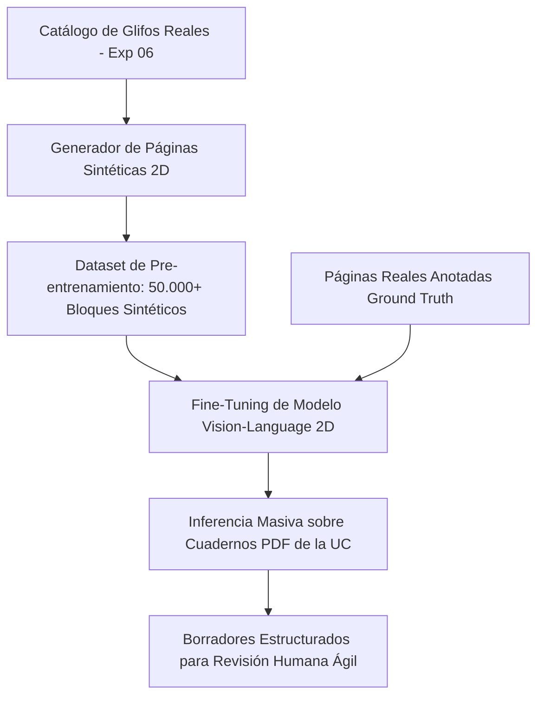

# 📜 Guía de Características Caligráficas y Estrategia de Modelado: Manuscritos de Francisco Coloane

**Proyecto:** Transcripción y Reconocimiento de Manuscritos de Francisco Coloane  
**Propósito:** Especificación técnica y lingüístico-caligráfica para el diseño, síntesis de datos y entrenamiento de modelos de Inteligencia Artificial especializados (HTR / Vision-Language).  
**Fecha de Creación:** Checkpoint Agosto 2026  

---

## 1. Contexto del Corpus Patrimonial

* **Origen:** Archivo Patrimonial Abierto de la Pontificia Universidad Católica de Chile (UC).
* **Magnitud del Acervo:** 78 libretas de apuntes y 228 cuadernos personales manuscritos (miles de páginas digitalizadas en alta resolución a 300 DPI).
* **Contenido:** Poemas inéditos, borradores de cuentos, crónicas y reflexiones de viaje en la Patagonia, Chiloé y Quemchi.
* **Naturaleza del Escrito:** Escritura rápida de campo (*boceto literario vivo*), alternando entre caligrafía reposada y cursiva acelerada, con tintas de diverso tono (azul, negra, roja y grafito).

---

## 2. Idiosincrasias y Fenómenos Caligráficos de Francisco Coloane

A diferencia de textos mecanografiados o caligrafías escolares uniformes, la escritura de Coloane presenta fenómenos específicos que cualquier pipeline de Inteligencia Artificial debe modelar explícitamente:

### 2.1 Colisiones Interlineales Severas (Superposición Vertical)
* **El Fenómeno:** Los lazos descendentes (*descenders*) de letras como `g`, `p`, `j`, `y`, `q` se extienden profundamente hacia el renglón inferior, entrelazándose con las astas ascendentes (*ascenders*) de letras como `d`, `l`, `t`, `b`, `f`.
* **Implicancia de Modelado:** Los métodos tradicionales que recortan tiras de renglones rectos **amputan estos trazos por la mitad**, convirtiéndolos en ruido visual. El análisis debe realizarse **en 2D sobre el bloque o la página completa**, permitiendo que la red neuronal entienda a qué línea pertenece cada bucle según la continuidad del trazo.

```
Línea N:   ...los grandes pájaros oceánicos...  ──┐ (el lazo de la 'p' y 'j' baja)
                       \  /                        │ -> COLISIÓN REAL
Línea N+1: ...dejando caer sus semillas errantes... ──┘ (el asta de la 'd' y 't' sube)
```

---

### 2.2 Deriva de la Línea Base (*Baseline Drift*) e Inclinación Orgánica
* La línea de base no es horizontal ni constante; tiende a curvarse hacia arriba o descender hacia el margen derecho a medida que la mano avanza en la hoja.
* La inclinación de los trazos (*slant angle*) oscila comúnmente entre **60° y 80°**, acentuándose en momentos de escritura veloz o apasionada.

---

### 2.3 Inserciones Interlineales y Palabras Flotantes (*Caret Insertions*)
* Coloane corregía y afinaba su prosa en el mismo acto de escribir, agregando palabras flotantes entre líneas (ejemplo: *"sus"*, conectores o pronombres sobrepuestos).
* El modelo debe procesar el contexto bidimensional para integrar estas inserciones en el orden de lectura semántico correcto, sin considerarlas caracteres anómalos o ruido de escaneo.

---

### 2.4 Coarticulación, Ductus y Travesaño Extendido (*T-Bar Spanning*)
* **Travesaño de la `t` Continuo:** El trazo horizontal de la letra `t` con frecuencia se proyecta hacia la derecha atravesando dos o tres letras continuas (ej. en palabras como *«este»*, *«travesía»*, *«todo»*).
* **Ligaduras Abiertas:** Pares de alta frecuencia como `de`, `en`, `es`, `co`, `ll`, `ch` se ejecutan en un solo impulso biomecánico continuo sin levantar la pluma.
* **Morfología de la `d`:** Bucle superior amplio que a menudo queda abierto o con forma de látigo hacia la izquierda.
* **Mayúsculas Gestuales:** Letras como `T`, `L`, `B`, `P`, `V`, `Q` presentan dimensiones hasta 3x mayores que el cuerpo medio de las minúsculas, con amplios bucles decorativos.

---

### 2.5 Tachaduras y Variantes Textuales
* Modificaciones mediante líneas simples horizontales, tachaduras onduladas o bucles continuos sobre palabras descartadas.
* El sistema debe ser capaz de etiquetar estas secciones como texto cancelado sin que interrumpan la transcripción de la versión definitiva.

---

## 3. Estrategia de Modelado y Entrenamiento para las Siguientes Fases



### 3.1 Fase de Datos: Síntesis Caligráfica 2D (*Synthetic Data Augmentation*)
* Utilizar los glifos de tinta pura RGBA catalogados en el **Experimento 06** para generar automáticamente miles de bloques y páginas sintéticas.
* **Parámetros de Síntesis:**
  - Variación aleatoria de espaciado interlineal con simulación de colisiones verticales realistas.
  - Texturas de fondo de papel de libreta antigua a 300 DPI.
  - Generación de inserciones flotantes y tachaduras para enseñar al modelo a ignorar o transcribir texto corregido.

### 3.2 Arquitectura del Modelo: Enfoque 2D por Bloques / Páginas Completas
* **Arquitecturas Recomendadas:**
  - **Vision Transformers (ViT) con Decodificadores Autoregresivos** (ej. TrOCR 2D, Donut, Nougat adaptado, o Fine-Tuning de Qwen2-VL / Gemma-Vision / Florence-2).
  - Entrada: Bloque completo de imagen a 300 DPI ($1024 \times 1024$ o resolución nativa).
  - Salida: Flujo de texto plano o estructurado en Markdown con saltos de línea y marcas de tachadura.

### 3.3 Filosofía Human-in-the-Loop (Borrador Asistido)
* **Objetivo de Precisión:** Alcanzar un 85% – 95% de fidelidad inicial en la inferencia automática.
* **Flujo Final:** El investigador visualiza la página manuscrita en un panel y el borrador generado por la IA en el panel contiguo, realizando únicamente la corrección de palabras ambiguas, acelerando la transcripción en un **90% respecto al método puramente manual**.

---

*Documento base de referencia para el entrenamiento y diseño de experimentos en el repositorio TRANSCRIPCIONES COLOANE.*
