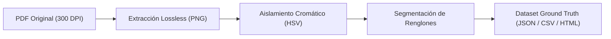

# Informe Experimental: Iteración 01 - Preprocesamiento, Segmentación y Ground Truth

> [!NOTE]
> **Objetivo:** Ejecutar una primera prueba de concepto (PoC) sobre las páginas 2 y 3 del manuscrito de Francisco Coloane (*"Escritos y relato desde Quemchi. 1977"*), cruzando la caligrafía manuscrita original con las transcripciones manuales de referencia para sentar las bases del pipeline HTR / OCR.

---

## 1. Resumen Ejecutivo de la Iteración

Se completaron con éxito las 4 etapas iniciales del flujo de trabajo:

1. **Extracción de Páginas:** Se extrajeron las Páginas 2 y 3 en resolución nativa de **300 DPI** (3507 × 4403 px), preservando el grano del papel y el trazo fino de la pluma/bolígrafo.
2. **Aislamiento Cromático:** Mediante análisis en el espacio de color HSV, se logró separar con precisión:
   - **Tinta Roja:** Anotaciones marginales verticales, títulos subrayados y correcciones (`Isla madre, sagrada...`, notas de estantería).
   - **Tinta Azul / Oscura:** Cuerpo del texto poético y narrativo.
3. **Segmentación de Renglones:** Se extrajeron **27 recortes individuales** correspondientes a líneas, títulos y versos.
4. **Dataset Ground Truth:** Se generó un dataset estructurado emparejando cada recorte visual con su transcripción exacta de verdad de terreno.

---

## 2. Estructura de Archivos Generados

Los archivos de este experimento se encuentran organizados en el workspace:

| Directorio / Archivo | Descripción |
| :--- | :--- |
| [`muestras_paginas/`](file:///C:/Users/WLADI/Desktop/COLOANE/TRANSCRIPCIONES%20COLOANE/muestras_paginas/) | Imágenes de alta resolución (`pagina_02.png`, `pagina_03.png`) y PDF de muestra. |
| [`experimentos/01_preprocesamiento/`](file:///C:/Users/WLADI/Desktop/COLOANE/TRANSCRIPCIONES%20COLOANE/experimentos/01_preprocesamiento/) | Máscaras de color aisladas (`mask_red.png`, `mask_blue.png`), ecualización CLAHE y binarización adaptativa. |
| [`experimentos/02_segmentacion_lineas/crops/`](file:///C:/Users/WLADI/Desktop/COLOANE/TRANSCRIPCIONES%20COLOANE/experimentos/02_segmentacion_lineas/crops/) | 27 imágenes recortadas de líneas individuales (`p03_l02_verso1.png`, `p02_l02_ezra1.png`, etc.). |
| [`experimentos/03_dataset_ground_truth/dataset_muestras_p02_p03.json`](file:///C:/Users/WLADI/Desktop/COLOANE/TRANSCRIPCIONES%20COLOANE/experimentos/03_dataset_ground_truth/dataset_muestras_p02_p03.json) | Dataset estructurado en JSON con metadatos, coordenadas de bounding box y texto de referencia. |
| [`experimentos/03_dataset_ground_truth/dataset_muestras_p02_p03.csv`](file:///C:/Users/WLADI/Desktop/COLOANE/TRANSCRIPCIONES%20COLOANE/experimentos/03_dataset_ground_truth/dataset_muestras_p02_p03.csv) | Versión tabular para fácil carga en PyTorch, Hugging Face o pandas. |
| [`experimentos/03_dataset_ground_truth/visualizador_dataset.html`](file:///C:/Users/WLADI/Desktop/COLOANE/TRANSCRIPCIONES%20COLOANE/experimentos/03_dataset_ground_truth/visualizador_dataset.html) | Galería interactiva para inspeccionar visualmente cada recorte junto a su texto transcrito. |

---

## 3. Muestra de Emparejamientos (Ground Truth vs. Manuscrito)

A continuación se ilustran algunos de los casos más representativos procesados:

### Caso A: Poema *"Travesías y Temporales"* (Página 3)
* **ID:** `p03_l02_verso1`
  * **Imagen:** `p03_l02_verso1.png`
  * **Transcripción:** *«Vientos del oeste»*
  * **Observación Caligráfica:** Trazo fluido de 'V' mayúscula abierta; 'st' ligado.

* **ID:** `p03_l05_verso4`
  * **Imagen:** `p03_l05_verso4.png`
  * **Transcripción:** *«dejando caer sus semillas errantes»*
  * **Observación Caligráfica:** Inserción interlineal de *"sus"* por encima de la línea base.

* **ID:** `p03_l13_rojo1`
  * **Imagen:** `p03_l13_rojo1.png`
  * **Transcripción:** *«Isla madre, sagrada…»*
  * **Observación Caligráfica:** Tinta roja con doble subrayado de énfasis.

### Caso B: Prosa y Citas *"Significaciones"* (Página 2)
* **ID:** `p02_l02_ezra1`
  * **Imagen:** `p02_l02_ezra1.png`
  * **Transcripción:** *««Un lenguaje cargado de significación»*
  * **Observación Caligráfica:** Comillas angulares francesas (`«`), subrayado lineal en tinta roja.

* **ID:** `p02_l09_poeta_ny`
  * **Imagen:** `p02_l09_poeta_ny.png`
  * **Transcripción:** *««Siente el olor en la grieta mas profunda»*
  * **Observación Caligráfica:** Inclinación dextrógira típica de Coloane, trazo continuo.

---

## 4. Hallazgos Clave para las Siguientes Fases

> [!TIP]
> **1. Separación Cromática como Filtro de Capas:**
> El cuaderno contiene anotaciones en dos momentos temporales distintos (tinta azul vs. lápiz/tinta roja). El filtrado por canal de color nos permite procesar el texto base y las correcciones de autor en capas semánticas independientes.

> [!IMPORTANT]
> **2. Variaciones de Escritura:**
> Coloane alterna entre:
> - Cursiva rápida encadenada (cuerpo de texto).
> - Mayúsculas imprenta / capitales (`TEMPORALES Y...`).
> - Tachaduras horizontales y correcciones supraescritas (inserciones interlineales).

---

## 5. Próximos Pasos Propuestos

1. **Prueba de Transcripción Asistida (Zero-Shot & Few-Shot):** Alimentar un modelo multimodal con los pares imagen-texto generados como ejemplos (few-shot prompting) para evaluar la precisión al transcribir una página nueva sin transcribir (e.g., Página 4 o 5).
2. **Ampliación de Alineación:** Si cuentas con más páginas ya transcritas en el documento de transcripción, podemos indexar esas páginas específicas para enriquecer el dataset de calibración.
