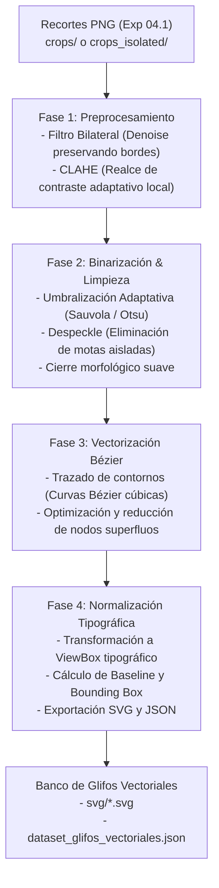

# Experimento 04.2: Vectorización de Glifos Caligráficos (Raster ➔ Vector SVG)

Este experimento implementa el pipeline de procesamiento digital y vectorización para convertir los recortes de mapa de bits (PNG) capturados en el **Experimento 04.1** en un **Banco de Glifos Vectoriales Escalables (`.svg`)** basados en curvas Bézier cúbicas, libres de fondo y con métricas tipográficas estandarizadas.

---

## 🎯 Objetivos del Experimento

1. **Extracción y Realce de Tinta:** Resaltar el contraste local de los trazos de pluma y eliminar el ruido, textura y manchas del papel original.
2. **Binarización y Limpieza Morfológica:** Generar máscaras de tinta de alta fidelidad que preserven la variación de presión, bucles internos y remates caligráficos característicos de la escritura de Francisco Coloane.
3. **Vectorización a Curvas Bézier:** Trazar el contorno (*outline*) de cada letra mediante curvas paramétricas suaves, optimizando el número de nodos sin perder la expresividad orgánica del trazo manual.
4. **Normalización Tipográfica:** Alinear y escalar los vectores dentro de un sistema métrico uniforme (*EM-Square* tipográfico de 1000×1000 unidades, línea de base y anchos de avance) para permitir su futura composición tipográfica o generación sintética.
5. **Inspección Visual Comparativa:** Proveer una herramienta interactiva para auditar lado a lado la imagen original, la máscara de tinta y el trazado vectorial resultante.

---

## 🏗️ Arquitectura del Pipeline

El proceso de conversión se estructura en **4 etapas secuenciales**:



---

## 📂 Estructura del Directorio

```
experimentos/04.2_vectorizacion_glifos/
│
├── README.md                          # Documentación del experimento y especificación técnica
├── pipeline_vectorizador.py          # Script CLI / Módulo Python para procesar glifos en lote
├── server_inspector.py                # Servidor local para la interfaz de auditoría y ajuste
├── inspector_vectorial.html          # SPA interactiva para comparar Raster vs Vector y ajustar parámetros
│
├── svg/                              # Carpeta de salida con los archivos vectoriales individuales (.svg)
│   ├── g_cap_xxx_01_A.svg
│   ├── g_cap_xxx_02_b.svg
│   └── ...
│
├── dataset_glifos_vectoriales.json   # Base de datos vectorial con paths SVG, nodos y métricas
└── dataset_glifos_vectoriales.csv    # Exportación tabular sincronizada
```

---

## 📐 Especificación del Formato Vectorial (SVG)

Cada glifo vectorial se exporta bajo los siguientes estándares:

* **Formato:** SVG 1.1 estándar (compatible con navegadores, Inkscape, Illustrator y FontForge).
* **Sistema de Coordenadas:** `viewBox="0 0 1000 1000"` (origen superior-izquierdo o tipográfico estándar).
* **Trazado:** Elementos `<path>` con comandos `M` (MoveTo), `C` (Cubic Bézier) y `Z` (ClosePath) rellenos con color plano (`fill="#000000"` / configurable) y fondo transparente.
* **Metadatos Tipográficos:**
  * `character`: Carácter representado (ej. `a`, `T`, `7`, `ñ`).
  * `category`: Categoría caligráfica (`mayuscula`, `minuscula`, `numero`, etc.).
  * `baseline`: Posición vertical normalizada de la línea base.
  * `x_height`: Altura de la x normalizada.
  * `node_count`: Cantidad total de puntos de control de las curvas Bézier.

---

## 🛠️ Requisitos y Dependencias

* **Python 3.10+**
* `opencv-python` (Procesamiento de imagen, filtros y morfología)
* `numpy` (Operaciones numéricas matriciales)
* `Pillow` (Manejo de imágenes y canales alfa)
* `vtracer` o motor nativo de vectorización Bézier
