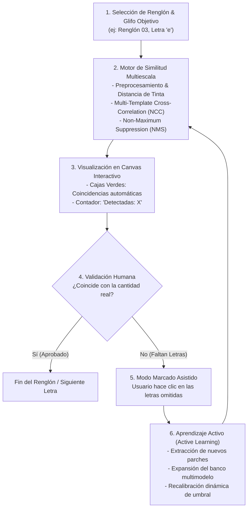

# Experimento 05: Interactive Glyph Spotting & Active Learning (Human-in-the-Loop)

Este experimento implementa un sistema interactivo de **Búsqueda y Localización de Glifos (*Glyph Spotting*)** con **Aprendizaje Activo (*Active Learning*)**, diseñado para identificar la presencia y ubicación de caracteres específicos a lo largo de los renglones manuscritos de Francisco Coloane.

---

## 🎯 Objetivos del Experimento

1. **Localización Óptica de Glifos (*Glyph Spotting*):** Detectar automáticamente todas las ocurrencias de una letra objetivo en una imagen de renglón o página manuscrita utilizando el banco de patrones extraídos en los Experimentos 04.1 y 04.2.
2. **Bucle de Aprendizaje Humano (*Human-in-the-Loop*):** Permitir al usuario indicar la cantidad real de letras presentes y marcar mediante clics directos los falsos negativos (letras omitidas por el algoritmo).
3. **Memoria y Calibración Dinámica (*Active Memory*):** Extraer automáticamente los parches visuales de las omisiones marcadas, incorporarlos al banco de plantillas activas del glifo (*Multi-Template Matching*) y ajustar el umbral de similitud en tiempo real.
4. **Validación Determinista Bottom-Up:** Proporcionar una base de detección visual explicable, rápida y sin alucinaciones previas a la integración con modelos de lenguaje.

---

## 🏗️ Arquitectura del Sistema



---

## 📂 Estructura del Directorio

```
experimentos/05_spotting_glifos_interactivo/
│
├── README.md                          # Especificación técnica y guía del experimento
├── server_spotter.py                  # Servidor backend en Python (Puerto 8003)
├── index.html                         # SPA interactiva con Canvas 2D y controles HUD
├── templates_memoria.json             # Banco persistente de variantes aprendidas por glifo
└── patches/                           # Recortes de variantes aprendidas dinámicamente
```

---

## ⚙️ Especificación de Algoritmos

### 1. Extracción y Normalización de Características
* La imagen del renglón y la plantilla del glifo se procesan mediante **Transformada de Distancia** sobre la máscara de tinta binarizada invertida (`cv2.distanceTransform`).
* Esto permite comparar la morfología y esqueleto de la pluma independientemente de variaciones sutiles en la densidad de tinta o el grosor del papel.

### 2. Multi-Template Matching Multiescala
* Para una letra con $K$ plantillas acumuladas (original + variantes aprendidas), la función de respuesta en la coordenada $(x, y)$ se define como:
  $$S(x, y) = \max_{k=1..K, s \in [0.85, 1.15]} 	ext{NCC}(I, T_k^{(s)})(x, y)$$
* Donde $	ext{NCC}$ es el Coeficiente de Correlación Cruzada Normalizado (`cv2.TM_CCOEFF_NORMED`).

### 3. Supresión de No-Máximos (NMS)
* Se eliminan cajas solapadas con un índice de intersección sobre unión ($	ext{IoU} > 0.30$), garantizando una única detección por carácter.

---

## 🚀 Guía de Uso

1. **Iniciar el servidor local:**
   ```powershell
   python experimentos/05_spotting_glifos_interactivo/server_spotter.py
   ```
2. **Abrir en el navegador:**
   [http://localhost:8003](http://localhost:8003)
3. **Flujo de Trabajo:**
   - Seleccionar un renglón manuscrito y una letra objetivo (ej: `e`).
   - El sistema ejecutará el escaneo y mostrará las coincidencias en verde.
   - Si faltaron ocurrencias, ingresar el total real o hacer clic en las posiciones omitidas.
   - Pulsar **"🧠 Aprender y Recalibrar"** para actualizar la detección instantáneamente.\n